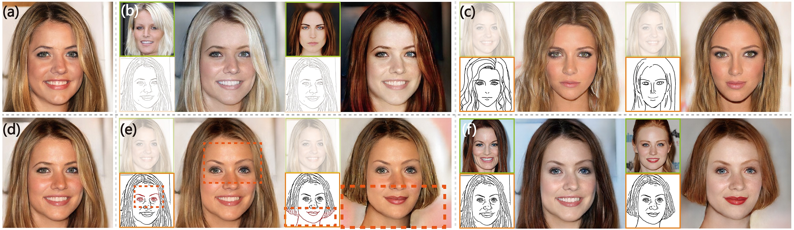
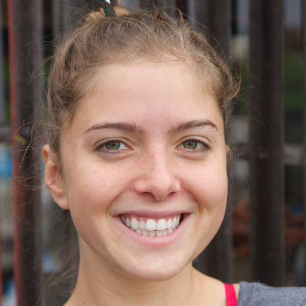
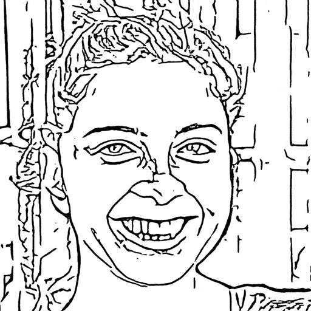

# DeepFaceEditing: Deep Face Generation and Editing with Disentangled Geometry and Appearance Control

One version of our system is implemented using the <a href="https://github.com/Jittor/Jittor" target="_blank">Jittor</a>, and you need to install Jittor first.

HomePage: <a href="http://www.geometrylearning.com/DeepFaceEditing/" target="_blank">http://www.geometrylearning.com/DeepFaceEditing/</a>



## Abstract
Recent facial image synthesis methods have been mainly based on conditional generative models. Sketch-based conditions can effectively describe the geometry of faces, including the contours of facial components, hair structures, as well as salient edges (e.g., wrinkles) on face surfaces but lack effective control of appearance, which is influenced by color, material, lighting condition, etc. To have more control of generated results, one possible approach is to apply existing disentangling works to disentangle face images into geometry and appearance representations. However, existing disentangling methods are not optimized for human face editing, and cannot achieve fine control of facial details such as wrinkles. To address this issue, we propose DeepFaceEditing, a structured disentanglement framework specifically designed for face images to support face generation and editing with disentangled control of geometry and appearance. We adopt a local-to-global approach to incorporate the face domain knowledge: local component images are decomposed into geometry and appearance representations, which are fused consistently using a global fusion module to improve generation quality. We exploit sketches to assist in extracting a better geometry representation, which also supports intuitive geometry editing via sketching. The resulting method can either extract the geometry and appearance representations from face images, or directly extract the geometry representation from face sketches. Such representations allow users to easily edit and synthesize face images, with decoupled control of their geometry and appearance. Both qualitative and quantitative evaluations show the superior detail and appearance control abilities of our method compared to state-of-the-art methods.

## Prerequisites

1. System

　- Ubuntu 16.04 or later

　- NVIDIA GPU + CUDA 10.0 

2. Software

　- Python 3.7

　- Jittor. More details in <a href="https://github.com/Jittor/Jittor" target="_blank">Jittor</a>

  ```
  pip install jittor
  ```

　- Packages

  ```
  pip install -r requirements.txt
  ```

## How to use

Please download the pre-trained model [Google Drive]</a>, then put those under 'checkpoints'.

#### Extract sketches from real images:

  ```
  python test_model.py --geo ./images/geometry.png --output ./results/sketch_gen.png --gen_sketch
  ```

 


#### Reconstruct faces of image A:

images provide geometry:

  ```
  python test_model.py --geo ./images/geometry.png --appear ./images/geometry.png --output ./results/recon_result.png --geo_type image
  

#### Generate faces with geometry of image A and appearance of image B:

images provide geometry:


  ```
  python test_model.py --geo ./images/geometry.png --appear ./images/appearance.png --output ./results/image_result.png --geo_type image
  ```

sketches provide geometry:

  ```
  python test_model.py --geo ./results/sketch_gen.png --appear ./images/appearance.png --output ./results/sketch_result.png --geo_type sketch
  ```


## Citation

If you found this code useful please cite our work as:

    @article {chenDeepFaceEditing2021,
        author = {Chen, Shu-Yu and Liu, Feng-Lin and Lai, Yu-Kun and Rosin, Paul L. and Li, Chunpeng and Fu, Hongbo and Gao, Lin},
        title = {{DeepFaceEditing}: Deep Generation of Face Images from Sketches},
        journal = {ACM Transactions on Graphics (Proceedings of ACM SIGGRAPH 2021)},
        year = {2021},
        volume = 40,
        pages = {90:1--90:15},
        number = 4
    }